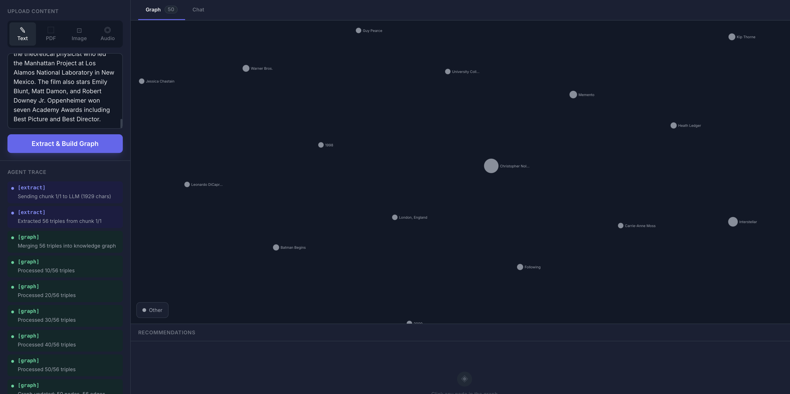
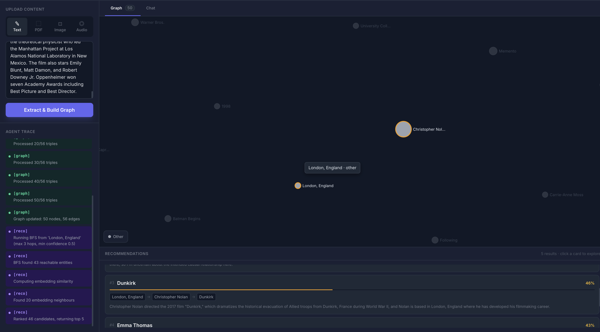
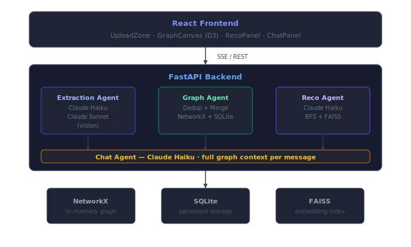

# KG Recommender

A full-stack agentic application that ingests multimodal content — text, PDF, image, or audio — extracts a live knowledge graph using an LLM pipeline, and returns explainable recommendations with visual reasoning paths. Built with FastAPI, React, D3.js, Claude, NetworkX, FAISS, and local Whisper.

---

## Screenshots

### Knowledge Graph

### Chat with your content

---

## Architecture

---

## How it works

When you upload content, three agents run in sequence and stream their progress to the UI in real time over Server-Sent Events.

**1. Extraction Agent**
Receives raw content and calls Claude to extract named entities and their relationships as structured triples. Each triple has a head entity, a relation type in snake_case, a tail entity, and a confidence score between 0 and 1. Text is chunked to 2000 characters per LLM call. PDFs are parsed page by page with header and footer stripping. Images are sent directly to Claude Sonnet via the vision API. Audio is transcribed locally using OpenAI Whisper before being passed to the same extraction pipeline as text.

**2. Graph Agent**
Receives the extracted triples and merges them into a live NetworkX directed graph backed by SQLite. Before inserting any entity, it slugifies the label and checks for an existing node — this prevents duplicates from case variation. Every insertion writes to SQLite first, so the graph survives server restarts. The graph accumulates across multiple uploads.

**3. Recommendation Agent**
When you click a node in the graph, the full graph is serialized as structured triples and sent to Claude Haiku as context. Claude reasons over the graph topology and your demonstrated interests to return specific named recommendations with a reasoning path and confidence score per result.

**4. Chat Agent**
The Chat tab gives you a multi-turn conversation grounded in your knowledge graph. Every message includes the full extracted graph as structured context, so Claude can answer questions about the content, surface non-obvious connections, make domain-specific recommendations, and ask clarifying questions. Conversation history persists for the session.

---

## Features

- Multimodal ingestion: text, PDF, image (jpg/png/webp), audio (mp3/wav/m4a)
- Live graph building: watch nodes and edges appear in real time as extraction runs
- Entity deduplication: same entity from different sources becomes one node
- Graph persistence: SQLite-backed, survives server restarts
- Click-to-recommend: click any graph node to get ranked recommendations with reasoning paths
- Grounded chat: multi-turn chat with full graph context, streams token by token
- Agent trace: every reasoning step is visible in the sidebar as it happens
- Reset graph: wipe the graph and start fresh with one click
- D3 force graph: interactive, draggable, color-coded by entity type, with hover tooltips and path highlighting

---

## Stack

| Layer | Technology | Cost |
|---|---|---|
| Frontend | React 18, Vite, TailwindCSS, D3.js v7 | Free |
| API server | FastAPI, Python 3.11, uvicorn | Free |
| LLM extraction | Claude Haiku claude-haiku-4-5-20251001 | ~$0.04 / 100 calls |
| LLM vision | Claude Sonnet claude-sonnet-4-20250514 | ~$0.30 / 20 calls |
| LLM chat + recommendations | Claude Haiku | ~$0.02 / 100 calls |
| Embeddings | all-MiniLM-L6-v2 via sentence-transformers | Free, runs locally |
| Vector search | FAISS flat index | Free, runs locally |
| Graph engine | NetworkX | Free |
| Graph persistence | SQLite | Free |
| Audio transcription | OpenAI Whisper base model | Free, runs locally |

---

## Local Setup

### Prerequisites

- Python 3.11
- Node.js 18+
- ffmpeg (required by Whisper for audio decoding)

Install ffmpeg on macOS:

    brew install ffmpeg

Install ffmpeg on Ubuntu:

    sudo apt install ffmpeg

### Install and run

Clone the repo:

    git clone https://github.com/kartikeyamandhar/kg-recommender.git
    cd kg-recommender

Create Python environment:

    python3.11 -m venv kg_rec
    source kg_rec/bin/activate
    pip install -r backend/requirements.txt

Set up environment variables:

    cp .env.example .env

Open .env and set your Anthropic API key:

    ANTHROPIC_API_KEY=sk-ant-...

Start the backend (terminal 1):

    uvicorn backend.main:app --reload

Runs on http://localhost:8000

Start the frontend (terminal 2):

    cd frontend
    npm install
    npm run dev

Runs on http://localhost:5173. Open this in your browser.

---

## Environment Variables

| Variable | Description | Required | Default |
|---|---|---|---|
| ANTHROPIC_API_KEY | Your Anthropic API key | Yes | none |
| DB_PATH | Path to SQLite database file | No | ./kg_store.db |
| VITE_API_BASE_URL | Backend URL for production frontend | No | empty string |

---

## Project Structure

    kg-recommender/
    backend/
        main.py
        agents/
            extraction_agent.py
            graph_agent.py
            recommendation_agent.py
            chat_agent.py
        graph/
            kg_store.py
            embeddings.py
        ingest/
            text_parser.py
            pdf_parser.py
            image_parser.py
            audio_parser.py
        models/
            schemas.py
        tests/
            test_phase1.py
            test_phase2.py
            test_phase3.py
            test_phase4.py
    frontend/
        src/
            App.jsx
            components/
                UploadZone.jsx
                GraphCanvas.jsx
                AgentTrace.jsx
                RecoPanel.jsx
                ChatPanel.jsx
            hooks/
                useStream.js
        package.json
        vite.config.js
    docs/
        images/
    .env.example
    README.md

---

## API Reference

### POST /ingest/text

Ingest plain text and stream extraction and graph update events.

Request body:

    { "text": "string, max 10000 chars" }

Response is text/event-stream:

    data: {"type": "step", "step": {"agent": "extraction", "message": "Sending chunk 1/1 to LLM"}}
    data: {"type": "triples", "triples": [...]}
    data: {"type": "graph_updated", "node_count": 12, "edge_count": 8}
    data: {"type": "done"}

### POST /ingest/pdf

Multipart form upload. Field name: file. Max 10MB. Same SSE response format.

### POST /ingest/image

Multipart form upload. Accepts jpg, png, webp. Max 10MB. Uses Claude Sonnet vision — extraction happens in one LLM call.

### POST /ingest/audio

Multipart form upload. Accepts mp3, wav, m4a. Max 10MB. Transcribed locally with Whisper before extraction.

### GET /graph

Returns the full current graph state:

    {
      "nodes": [{"id": "christopher_nolan", "label": "Christopher Nolan", "type": "person"}],
      "edges": [{"source": "christopher_nolan", "target": "inception", "relation": "directed", "confidence": 0.95}]
    }

### DELETE /graph

Wipes all nodes, edges, and the FAISS embedding index. Returns {"status": "reset"}.

### POST /recommend

Request body:

    { "entity_id": "christopher_nolan", "k": 5 }

Streams recommendations with paths and explanations.

### POST /chat

Request body:

    {
      "message": "What themes connect these films?",
      "history": [{"role": "user", "content": "..."}, {"role": "assistant", "content": "..."}]
    }

Streams response token by token.

---

## Running Tests

    source kg_rec/bin/activate
    ANTHROPIC_API_KEY=test-key python -m pytest backend/tests/ -v

All tests use mocked LLM clients. No real API calls are made during testing.

---

## Roadmap

- Neo4j migration: replace NetworkX and SQLite with Neo4j for graphs exceeding 10000 nodes, enabling Cypher queries and native graph algorithms at scale
- Pre-seeded domain knowledge: ship with a base layer of books, films, tools, and people so user entities immediately connect to a rich topology
- Real-time collaborative graph building: WebSocket-based multi-user sessions where multiple users ingest content simultaneously and watch the shared graph update live
